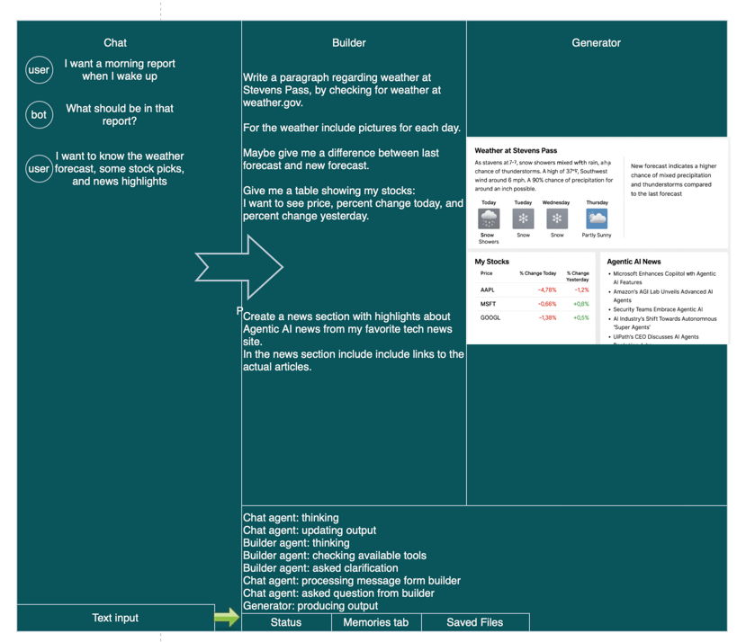
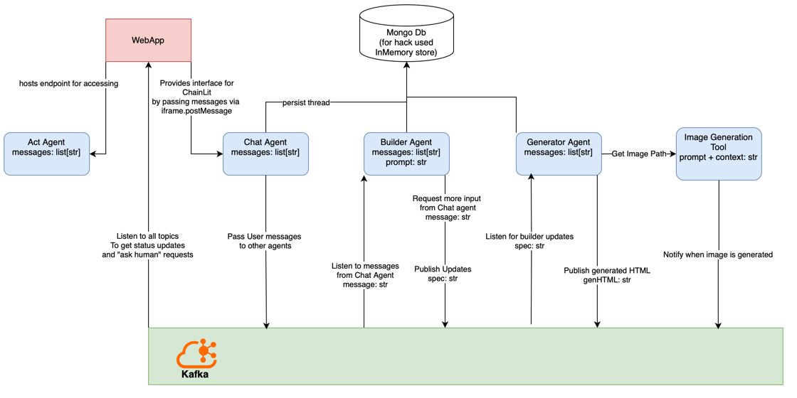
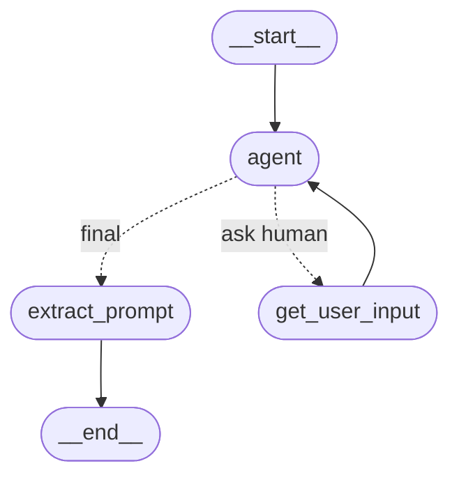
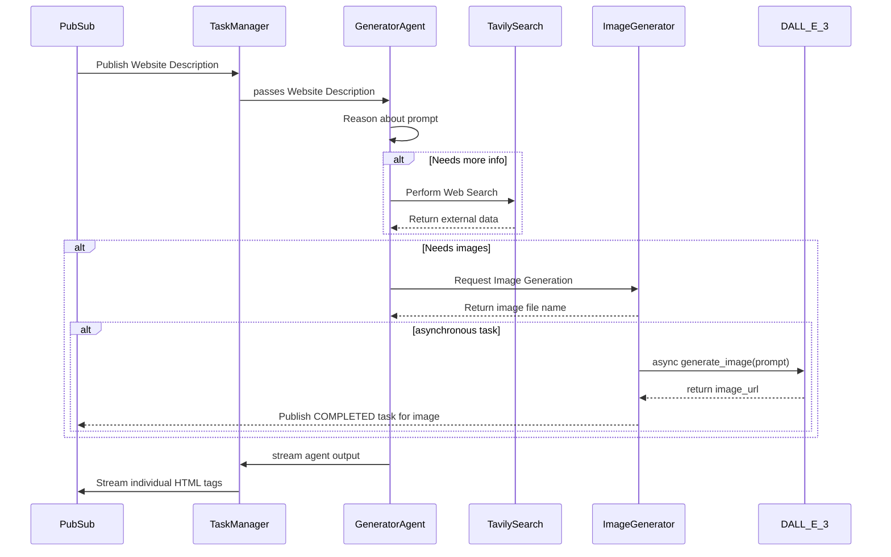
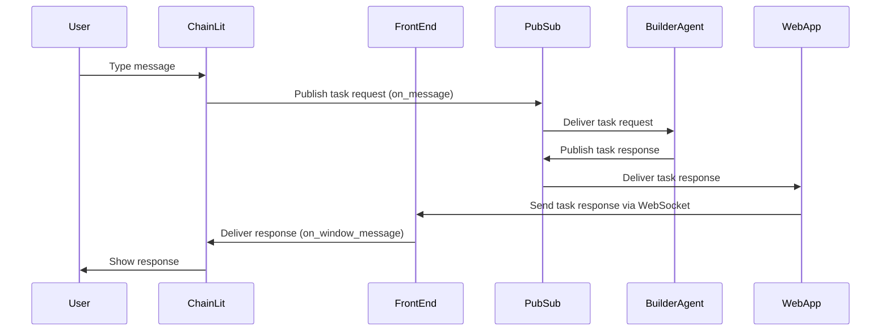
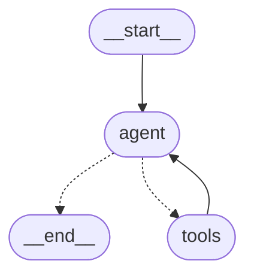
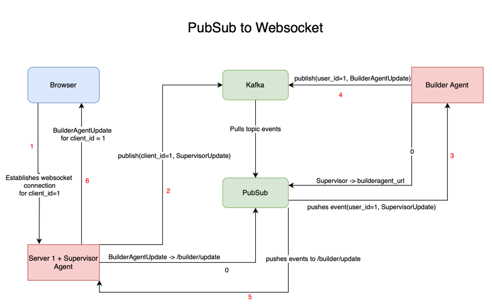
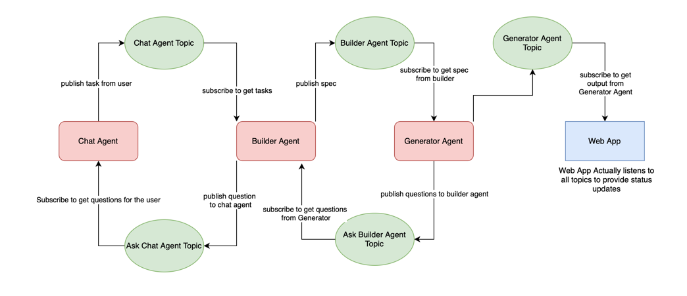

# disc-site

DisC stands for Documentation is Code. It is a concept where an AI agent reads natural language instructions 
and executes them similar to how an interpreter executes python code instructions.

`disc-site` is a DisC solution for generating highly personalized websites.

## The Problem

The internet has deviated from its original promise of providing information that you need on demand and here are some reasons why:
* Ad driven platforms are using opaque algorithms to guide your discovery of information
* Attention harvesting platforms create distractions instead of focusing on what you need
* Algorithms impede discovery of internet resource by giving you a siloed experience

All of that makes users exposed to suboptimal, impersonal, and in some cases harmful presentations of internet resources. For example:
* Shopping on a budget is a hassle, because while you monitor availability and prices on Marketplace, Amazon, Ebay, Etsy, REI, Craigslist, Buy Nothing, OfferUp, you are constantly surrounded by ads and guided by opaque algorithms.
* News aggregators try to feed you clickbait, misinformation, and targeted content.
* Social media platforms have focused on attention harvesting instead of facilitating meaningful interactions with your friends and communities.
* And for all of the above, popups and ads litter the screen obscuring content useful to you.
* Flashy ads are purposefully trying to get clicks from kids
* For people who love outdoors, weather websites require many interactions to find the right information resulting in wasted time.
* Countless other examples exist

## The Solution
What if you could build software by typing up the requirements without writing any code? What if you could build your own website that contains all the information you need without ads and distractions?

With the advent of useful LLMs and using Event Driven Agentic Architectures, `disc-site` will allow every human to build their own sites by simply typing in their own native language. Let the agent do the annoying job of browsing the web and gathering information and then present you with a clean website containing the information that you can actually use.

## Implementation
### User Interface

* For this hack, I was able to implement the Chat, Builder, Generator, and Status panels.
* The user communicates with Builder using the chat, then the builder sends tasks to the Generator, then the generator builds the HTML and streams to the `iframe` on the front end.
* Status subscribes to all the agent topics and tries to provide some insights into what is going on in the background.
* The user can also directly edit the spec created by the builder and send it to the generator
* Highlighting elements inside the generated site allows to provide inline requests to the builder
* Interactive sites can be generated and post requests from those go the Act Agent who can execute them
* Deployment of the static site is not yet implemented

### Agent Architecture

* At the core of the architecture is the PubSub implementation with Kafka message broker for communication. (See [PubSub Architecture](#Event-Driven-Architecture-using-Publisher-Subscriber-Pattern))
* WebApp, Chat Agent (a pseudo agent for now), Builder Agent, and Generator Agent communicate using PubSub and kafka topics.(See [Communication Scheme](#Communication-Scheme))

### Builder Agent
* The Builder Agent is a server that hosts the agent in the spirit of A2A protocol. Although currently only supports SendTaskRequests and SendTaskResponses without streaming. 

* The Builder Agent's job is to help craft a well written spec for the Generator Agent. It knows about the Generator Agent's capabilities and best practices for writing requirements for the Generator Agent.

#### Basic Operational Flow
1. It handles incoming tasks by subscribing to the pubsub topic
2. It then publishes responses to its own pubsub topic
3. In the future, it will be streaming by turning into a plan and execute agent streaming each execution step.

The agent is a langgraph custom agent that looks like this:

For more information see [Builder Agent README.md](builder_agent/README.md)

### Generator Agent
* The Generator Agent is a server that hosts the agent in the spirit of A2A protocol. Although currently only supports SendTaskRequests and SendTaskResponses $with$ streaming.
* It subscribes to a pub sub topic to receive detailed description of a website to be generated.
* It uses DALL-E model deployed on Azure AI Foundry for image generation.
* It uses Tavily Web Search to look up information.

#### Basic Operational Flow
1. Generator Agent subscribes to pubsub topic where description of a website gets published.
2. It reasons about the prompt and may decide to look up information using Tavily Web Search.
3. It may decide to generate a number of image using DALL-E 3 model 
4. The image generation tool returns file name, but the image is generated in the background.
5. Once the agent has data and image names, it will start generating html.
6. Task Manager will stream individual html tags to a PubSub topic.
7. When an image is completed, the Image Generator tool will publish a COMPLETED task for that image to the same PubSub topic

For more information see [Generator Agent README.md](generator_agent/README.md)

### Chat Pseudo agent
Chat agent is a server that hosts ChainLit app. 
- It is currently not a real agent, but it is intended to be one in the future in order to handle complex features.
- It is an A2A Client that sends TaskRequests to PubSub topic for the Builder Agent
- It receives responses from the app via `on_window_message` event passed by the WebApp through an iframe.

#### Basic Operational Flow
1. The user types a message to start interaction.
2. ChainLit `on_message` event handler generates a task request and sends it to the pubsub topic
3. The Builder Agent listens to that topic and picks up the task request
4. The Builder Agent generates a task response and sends it back to its own pubsub topic
5. WebApp uses WebSocket to pass the task response back to the front end
6. Front end posts message to the iframe
7. ChainLit `on_window_message` event handler picks up the response and shows it to the user

For more information see [Chat Agent README.md](chat_agent/README.md)

### Act Agent
- Act Agent is a standalone agent implement using Azure AI Foundry and is accessed via a WebApp endpoint. 
- One benefit of turning it into an A2A is to allow communication with the Generator Agent to learn how the Act Agent can support the Generator Agent.

- Its purpose is to support interactivity for a generated webpage. Since the tasks could be of any kind we need an agent,
not just any endpoint. In fact, it is basically an MCP server that could in theory support any kind of tool. A higher order MCP server?
A dynamic MCP server?

- For example, right now it supports storing data in a file to handle form submissions, but in the future, it could send
an email, write a GitHub issue comment, write to a DB, and any other thing that you can find an MCP server for.

#### Basic Operational Flow

1. Takes a prompt
2. Determines which tool is needed
3. Calls tool
4. Sends back feedback

For more information see [Act Agent README.md](act_agent/README.md)

### Event Driven Architecture using Publisher-Subscriber Pattern

- This diagram shows the full cycle of communication between the agents and the browser and highlights how session id is passed between them.
- PubSub is my own implementation of Google PubSub using Kafka for message queuing

#### Basic Operational Flow

0. WebApp and agent subscribe to various topics
1. Browser establishes session for its websocket connection
2. After some interactions, WebApp publishes a task request tagging it with session id (task_id too, but not shown here)
3. PubSub pushes the task request to the agent3.1 
4. After using session_id to get state from memory store and performing its task, the Agent publishes a task response tagged with session_id(and task_id)
5. PubSub pushes the task response to the WebApp
6. WebApp pushes the task response to the browser 

For more information see [PubSub README.md](pubsub/README.md)
### Communication Scheme

- This diagram maps out the topics and their roles.
- WebApp subscribes to all topics in order to provide status updates to the user

## Demo
View the main demo: https://youtu.be/9UjL_a_ux_E

Building website specification from scratch: https://youtu.be/XOKMDUcFTGQ

Building a Survey deep dive: https://youtu.be/4We3DAuwgVk

Publisher Subscriber deep dive: https://youtu.be/ZdHUaKFHceI

## Technologies Used
- A2A protocol for agent to agent communication model
- My own PubSub+Kafka implementation for event driven architecture
- Azure Deployed DALL-E model for image generation
- Azure Agent Services for Act Agent
- OpenAI for gpt-4.1 model support (significantly better than 4o in following instructions)
- Tavily Web Search for web search
- LangGraph for ReactAgents and Custom flows
- Chainlit for chatbot UI
- WebSockets for real-time communication between WebApp and Browser

## Target Audience
- People who don't like ads
- People who want to avoid attention harvesting platforms
- People who love finding the cheapest prices by using their own personal shopping portal
- People who need personalized presentation of information
- Event organizers who want to make their events more engaging

## Future Work (if I had more time)
#### General Usability Improvements
- Lots of UI work
- Better error handling
- Support deploying the static site to the cloud so that it is accessible from anywhere
- Performance optimizations like caching/reusing previously generated images and html and only streaming changes to the data.
- Proper Task Management for the A2A Agents
- User to be able to inject code for custom tool use
- Memories vector store to be able to re-use data from previous interactions
- Secret store for credentials sharing
- 
#### Generator Agent
- Making the Generator Agent work smarter by splitting up the work into async tasks such as generating skeleton of the site, generating images, gathering data, and then stitching all of them together
- Allow Generator to generate custom code and running it using CodeInterpreter tool (with the permission of the user)
- Allow using previously created, or user uploaded images 
- Enable talking to Builder if requested build needs more info or feature is not supported.

#### Builder Agent
- Builder Agent to use Plan-and-Execute pattern with streaming could also make transition from prompt to generating HTML smoother

#### Chat Agent
- Chat agent to be an actual agent, this could determine when new tasks begin. Right now have to say "forget previous instructions"
- When asking multiple choice questions, produce buttons to avoid too much typing
- Support uploading files for RAG

#### Act Agent
- Act Agent to support use of MCP server library. It will determine which MCP servers are needed for a given task and then use them to complete
- Act Agent to talk to builder and generator to let them if credentials are missing in order to get them from the user

