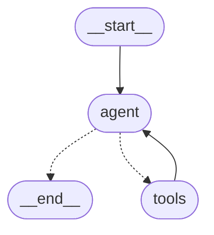

# Act Agent

Act Agent is a standalone agent that is accessed via an endpoint. It is currently hosted by the web app. But it could be
an A2A agent in the future. One purpose benefit turning it into an A2A is to allow communication with the Generator
Agent to learn how the Act Agent can support the Generator Agent.

Its purpose is to support interactivity for a generated webpage. Since the tasks could be of any kind we need an agent,
not just any endpoint. In fact, it is basically an MCP server that could in theory support any kind of tool. A higher order MCP server?
A dynamic MCP server?

For example, right now it supports storing data in a file to handle form submissions, but in the future, it could send
an email, write a GitHub issue comment, write to a DB, and any other thing that you can find an MCP server for.

## Basic Operation Flow

1. Takes a prompt
2. Determines if tool is needed
3. Calls tool, or provides answer

## Implementation Details

It is implemented using Azure AI Agent Services. Each invocation runs in own thread because it doesn't need to remember
state. It is basically a dynamic MCP server (new concept introduced in this hack).

## Setup

Don't forget to provide your OPEN_AI_KEY in .env file.

## Testing and Debugging

Run the app with `python agent.py` to test it.