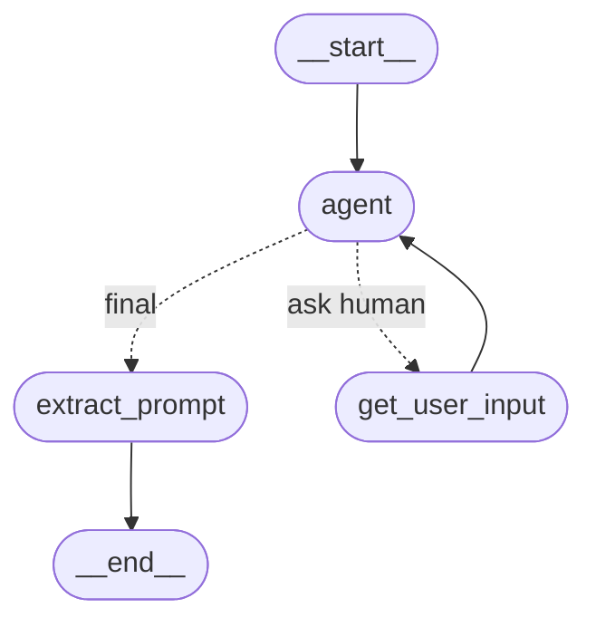

# Builder Agent

Builder Agent is a server that hosts the agent in the spirit of A2A protocol. Although currently only supports SendTaskRequests and SendTaskResponses without streaming. 

Uses PubSub server for communication.

## Basic Operation Flow
1. It handles incoming tasks by subscribing to the pubsub topic
2. It then publishes responses to its own pubsub topic
3. In the future, it will be streaming by turning into a plan and execute agent streaming each execution step.

## Implementation Details
It is running in fastAPI web server that handles tasks from clients.

The agent is a langgraph custom agent that looks like this:



## Setup

Don't forget to provide your OPEN_AI_KEY in .env file.


## Testing and Debugging

`main.py`, `task_manager.py`, and `agent.py` have entry points defined for testing and debugging. 

Find `builder_agent.Dockerfile` somewhere in the repo for more details.

After starting the agent using docker-compose, you can run integration tests:
```
python integration_test/builder_agent.py
```