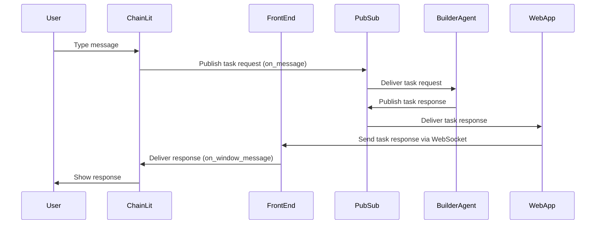

# Chat Agent

Chat agent is a server that hosts ChainLit app. 
- It is currently not a real agent, but it is intended to be one in the future in order to handle multi-modal tasks and other complex features.

- It communicates with other parts of the app through PubSub to send requests.
It receives responses from the app via `on_window_message` event passed by the app through an iframe.

## Basic Operation Flow
1. The user types a message to start interaction.
2. ChainLit `on_message` event handler generates a task request and sends it to the pubsub topic
3. The Builder Agent listens to that topic and picks up the task request
4. The Builder Agent generates a task response and sends it back to its own pubsub topic
5. WebApp uses WebSocket to pass the task response back to the front end
6. Front end posts message to the iframe
7. ChainLit `on_window_message` event handler picks up the response and shows it to the user

## Setup

Don't forget to provide your OPEN_AI_KEY in .env file.

## Testing and Debugging
Run the app with `python main.py` to test it.

Find `chat_agent.Dockerfile` somewhere in the repo for more details