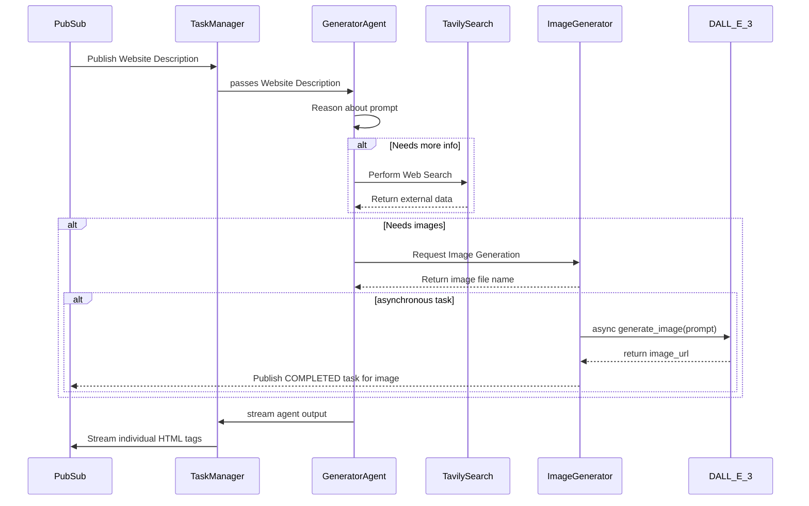

# Generator Agent

* Generator Agent is a server that processes tasks in the spirit of te A2A protocol.
* It subscribes to a pub sub topic that contains detailed description of a website to be generated.
* It uses DALL-E model deployed on Azure AI Foundry for image generation.
* It uses Tavily Web Search to look up information.


## Basic Operation Flow
1. Generator Agent subscribes to pubsub topic where description of a website gets published.
2. It reasons about the prompt and may decide to look up information using Tavily Web Search.
3. It may decide to generate a number of image using DALL-E 3 model 
4. The image generation tool returns file name, but the image is generated in the background.
5. Once the agent has data and image names, it will start generating html.
6. Task Manager will stream individual html tags to a PubSub topic.
7. When an image is completed, the Image Generator tool will publish a COMPLETED task for that image to the same PubSub topic



## Implementation Details
It is running in fastAPI web server that handles tasks from clients.

The agent is a langgraph react agent. It will take the task payload and asynchronously stream the output. The task manager handles task streaming A2S protocol details.

Currently only supports SendTaskRequests and SendTaskResponses with streaming.


## Setup

You will need the following in your .env file:
* OPENAI_API_KEY - for LLM reasoning
* AZURE_OPENAI_API_KEY - for the DALL-E model
* AZURE_OPENAI_ENDPOINT - for the DALL-E model
* TAVILY_API_KEY - for Tavily Web Search

## Testing and Debugging

`main.py`, `task_manager.py`, and `agent.py` have entry points defined for testing and debugging. 

Find `generator_agent.Dockerfile` somewhere in the repo for more details.

After starting the agent using docker-compose, you can run integration tests:
```
python integration_test/generator_agent.py
```